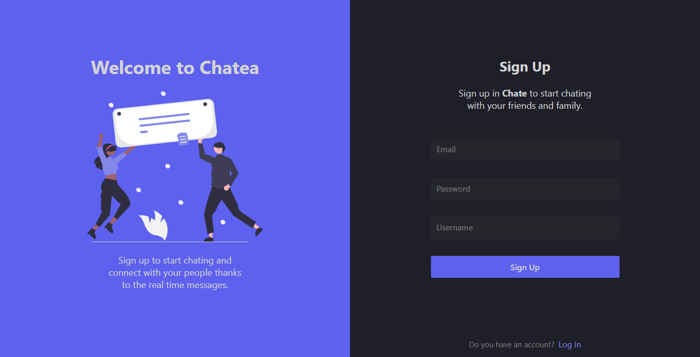
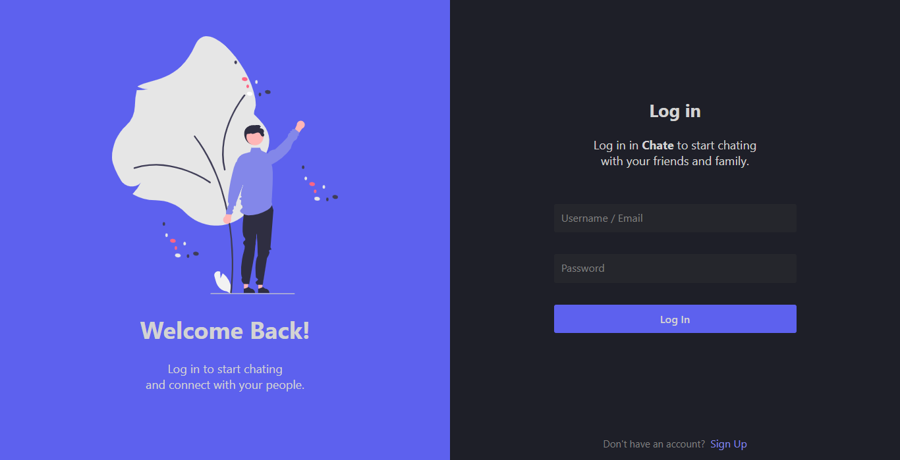
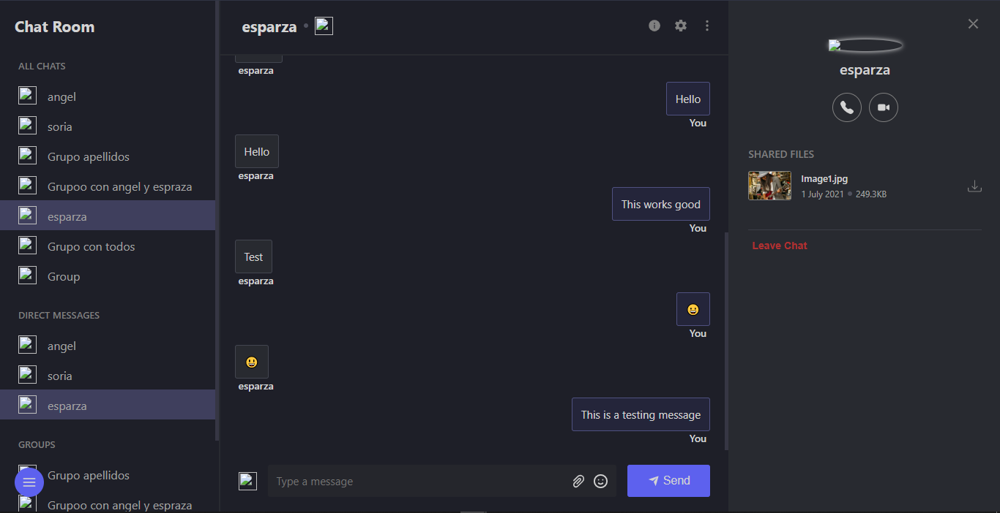
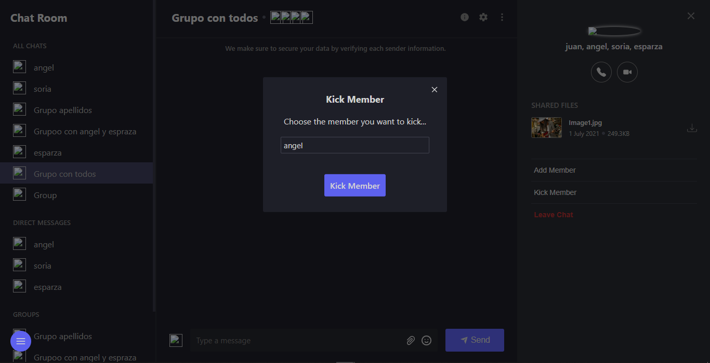
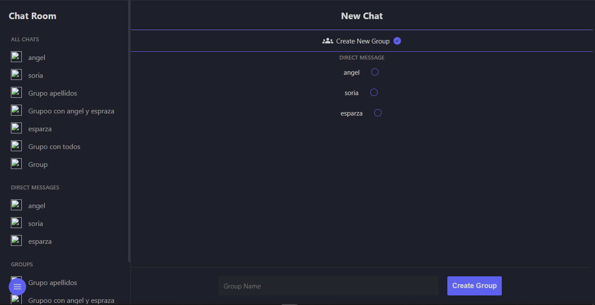
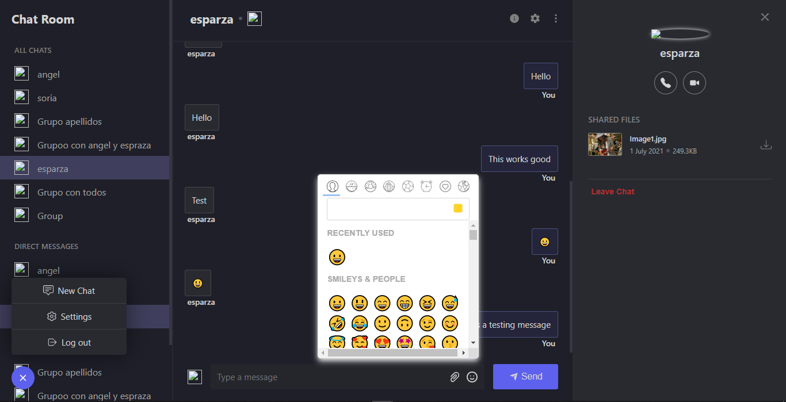
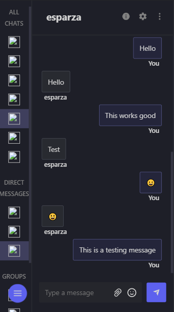
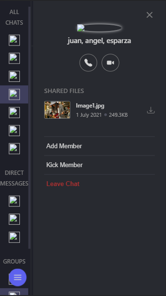

# chatea-frontend

Chat Frontend usign ReactJS, and consuming own Rest-API.

[BackEnd (Rest-API)](https://github.com/JuanSoriaE/chatea-backend)

## Screenshots

Signup

Login

Main page

Modal

New chat page

Menu and emojipicker

Main page Mobile

Side panel Mobile

